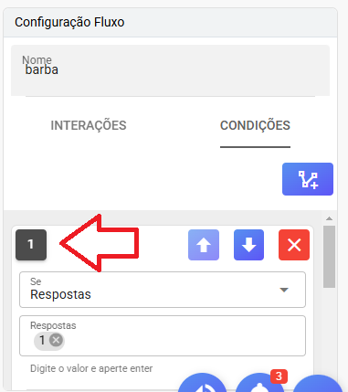
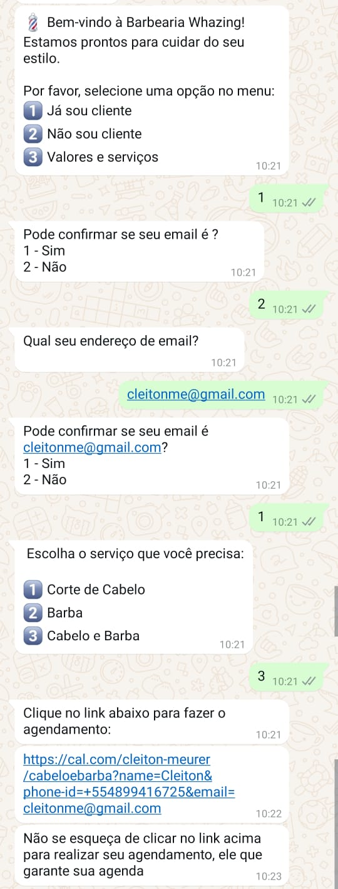

## Breve Resumo de Algumas Configurações do Chatbot Interno

### Configuração de Fluxo


1. **Configurar Fluxo**

   

   - As interações na versão 2.8.4 incluem:
     - **Enviar Mensagem**: Coloque o texto que será enviado ao cliente. É possível usar variáveis (ver documentação).
     - **Enviar Documentos, Vídeos, Áudios e Outros Arquivos**: Para envio de arquivos.
     - **Adicionar Delay**: Defina um tempo em segundos entre mensagens.
     - **Adicionar Tag**: Marque uma etiqueta no contato.
     - **Adicionar Webhook (GET)**: Envie informações para um sistema externo (por exemplo, variáveis capturadas no atendimento).

### Ordem das Interações

   

   - Este número indica a ordem em que as interações serão executadas.
   - Quando enviar mais de uma mensagem, coloque um delay entre elas para garantir que sejam enviadas na ordem correta.

### Configuração de Condições



   - Na tela de condições, a prioridade das condições é importante. 
     - **Qualquer Resposta**: Executa qualquer resposta do cliente. Lembre-se de deixar esta condição sempre por último.
     - **Respostas**: Deve ser uma resposta exata. Exemplo: "1". Se o cliente escrever "quero 1", a condição não será executada. Pode incluir mais opções, exemplo: "1" e "01".
     - **Contém Exato**: Palavras dentro da frase. Exemplo: cadastrar "quero comprar". Se receber a mensagem "Eu quero comprar um tênis", a condição será executada.
     - **Contém**: Palavras ou partes de palavras. Exemplo: cadastrar "compra". Se receber "estou comprando" ou "eu sou comprador", a condição será acionada.
     - **Dentro do Horário de Atendimento**: Executa esta condição dentro do horário de atendimento. Lembre-se de deixar no início.
     - **Fora do Horário de Atendimento**: Executa esta condição fora do horário de atendimento. Lembre-se de deixar no início.

### Exemplos de Fluxos para Chat Interno

#### Fluxo que Muda pelo Horário de Atendimento

   - Este fluxo simula uma empresa de seguros que tem um plantão para emergências.

     
     

   - [Fluxo de Exemplo](horario_de_atendimento.json)

#### Fluxo com Uso de Variáveis Dinâmicas

   - Neste fluxo, você pode fazer perguntas ao cliente e guardar uma variável para usar depois.

   - [Fluxo de Exemplo](exemplo_fluxo_usando_novas_variaveis.json)

   Exemplo de uso:
   ```bash
   Por favor, confirme se seu endereço é {{endereco}}?
   1 - Sim
   2 - Não
   ```

   O bot vai enviar:
   ```bash
   Por favor, confirme se seu endereço é Rua Marechal Deodoro, 11?
   1 - Sim
   2 - Não
   ```

#### Fluxo para Agendamento com Cal.com

   - Exemplo de fluxo que envia o link [https://cal.com/](https://cal.com/) para fazer agendamentos.

   - [Fluxo de Exemplo](agendamentobarbearia.json)

   